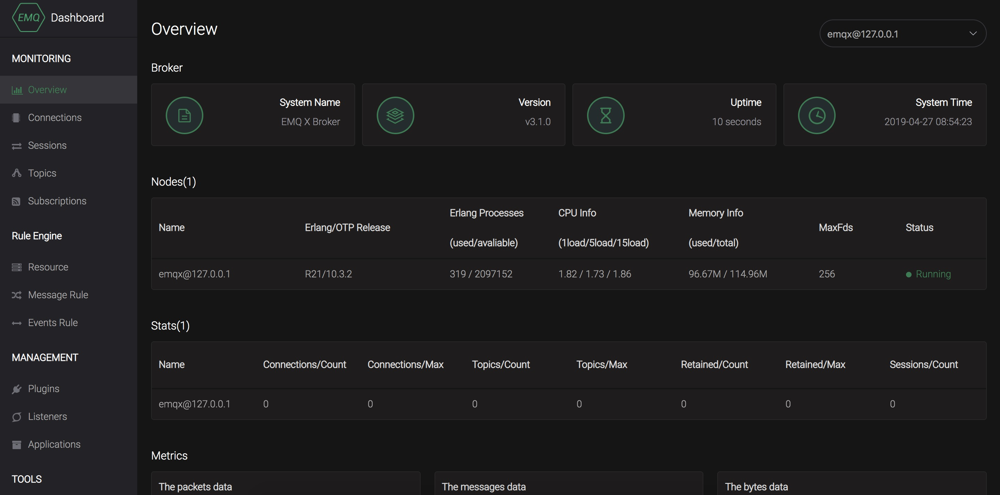
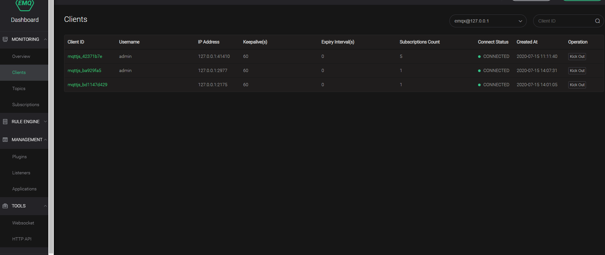
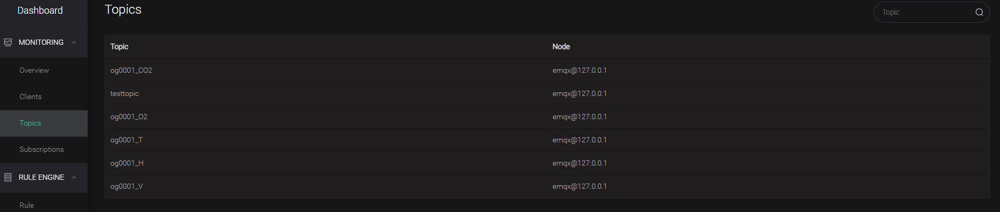
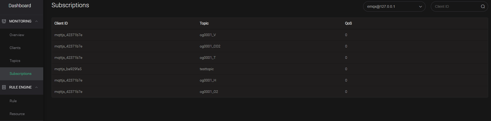
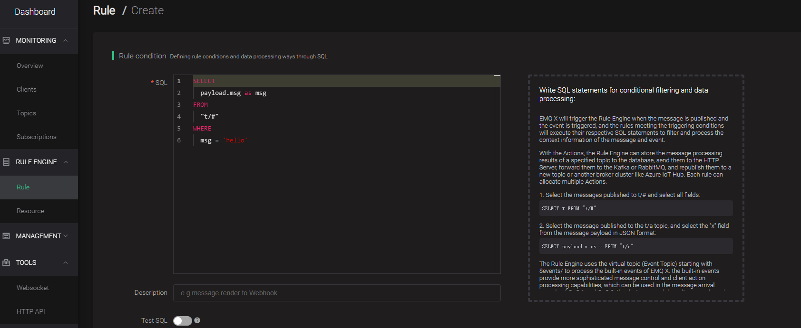
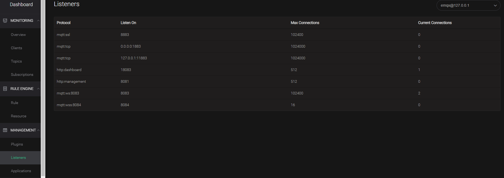
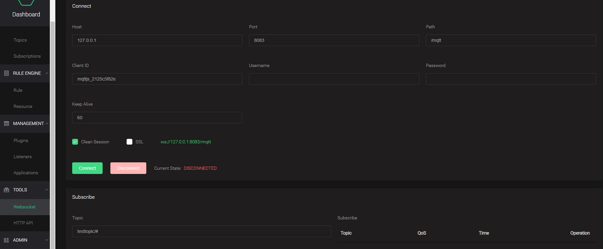

# Use MQTT with EMQX

##### EMQ X Broker介绍

EMQ X (Erlang/Enterprise/Elastic MQTT Broker) 是基于 Erlang/OTP 平台开发的开源物联网 MQTT 消息服务器。Erlang/OTP 是出色的软实时(Soft-Realtime)、低延时(Low-Latency)、分布式(Distributed) 的语言平台。MQTT 是轻量的(Lightweight)、发布订阅模式(PubSub) 的物联网消息协议。

*EMQ X* 面向海量的 **移动/物联网/车载** 等终端接入，并实现在海量物理网设备间快速低延时的消息路由:

1. 稳定承载大规模的 MQTT 客户端连接，单服务器节点支持百万连接。

2. 分布式节点集群，快速低延时的消息路由，单集群支持千万规模的路由。

3. 消息服务器内扩展，支持定制多种认证方式、高效存储消息到后端数据库。

4. 完整物联网协议支持，MQTT、MQTT-SN、CoAP、LwM2M、私有 TCP/UDP 协议支持。

5. **订阅者(Subscriber)** 会向 **消息服务器(Broker)** 订阅一个 **主题(Topic)** 。成功订阅后，消息服务器会将该主题下的消息转发给所有的订阅者。

   主题(Topic)以 ‘/’ 为分隔符区分不同的层级。包含通配符 ‘+’ 或 ‘#’ 的主题又称为 **主题过滤器(Topic Filters)**; 不含通配符的称为 **主题名(Topic Names)** 例如:

   ```
   sensor/1/temperature
   
   chat/room/subject
   
   presence/user/feng
   
   sensor/1/#
   
   sensor/+/temperature
   
   uber/drivers/joe/inbox
   ```

   注解

   注: ‘+’ 通配一个层级，’#’ 通配多个层级(必须在末尾)。

   注解

   注: 发布者(Publisher) 只能向 ‘主题名’ 发布消息，订阅者(Subscriber) 则可以通过订阅 ‘主题过滤器’ 来通配多个主题名称。

##### Windows安装EMQ X服务

1. 通过 [emqx.io](https://www.emqx.io/downloads/broker?osType=Linux) 或 [github](https://github.com/emqx/emqx/releases) 选择 Windows 版本，然后下载要安装的 .zip 包。

2. 解压压缩包

3. 打开 Windows 命令行窗口，cd 到程序目录， 启动 EMQ X。

   ```
   cd emqx/bin
   emqx start
   
   # 检查运行状态
   emqx_ctl status
   
   # 停止emqx
   emqx stop
   ```

   安装EMQ X为服务

   ```
   cd emqx/bin
   emqx install
   ```

4. EMQ X 启动后，MQTT客户端可通过1883端口接入系统，运行日志输出在log/目录。

   *EMQ X* 默认加载 Dashboard 插件，启动 Web 管理控制台。用户可通过 Web 控制台，查看服务器运行状态、统计数据、连接(Connections)、会话(Sessions)、主题(Topics)、订阅(Subscriptions)、插件(Plugins)等。

   控制台地址: [http://127.0.0.1:18083](http://127.0.0.1:18083/)，默认用户名: admin，密码：public

   

5. 在overview中可以查看已经连接的client信息，如下所示

   

   查看已发布的主题信息

   

   查看订阅者的信息，不同client所订阅的主题信息

   

   Rule可以对信息进行处理，并配置处理后的Action

   

   在listener中，可以查看不同连接的信息

   

   在tools中，可以订阅主题，发布主题，进行简单测试

   

   发布主题信息

   